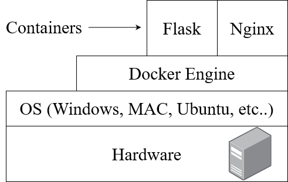
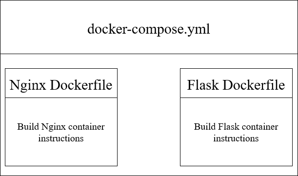
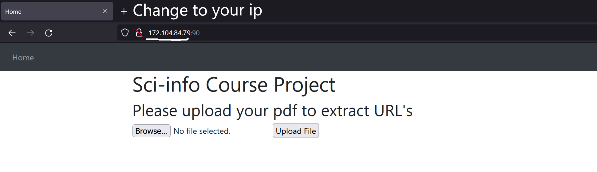

# Docker Setup:


This folder contains the files to build 2 docker images.

1. Flask image - python framework for the website
2. NGINX image - for load balancing


Docker Container Diagram


### Basic concepts:
* To run a docker container, you need a docker image.
* To  create a custom docker image you need a **Dockerfile** (capital D and without extension)
* A Dockerfile contains the instructions for build the image. 
* Your docker image can then be run in a container with the command `docker run [OPTIONS] IMAGE [COMMAND] [ARG...]`
* To set multiple images to work toguether we use *Docker Compose*
* A **docker-compose.yml** specifies intructions to run multiple containers toguether.


### Folder Structure:
```
C:.
│   docker-compose.yml
│   README.md
│
├───flask
│   │   .dockerignore
│   │   app.ini
│   │   app.py
│   │   assess_txt.py
│   │   Dockerfile
│   │   reprod.py
│   │   requirements.txt
│   │   wsgi.py
│   │
│   ├───static
│   │   └───files
│   │           README.txt
│   │
│   └───templates
│           base.html
│           home.html
│           references.html
│
├───nginx
│       Dockerfile
│       nginx.conf
│
└───pictures
        docker-compose.png
        docker_container_diagram.png
        
```

### Pre-requisites
1. At least 3GB ram
1. At leasat 600 MB strorage space.
1. [Docker](https://docs.docker.com/engine/install/). Follow the instructions in the link to download for your OS. 
    * If you are using windows you will need to:
        * install WSL 2 kernel (after installing docker, a pop up with the link to download WSL2 will appear)
        * Enable HyperV and containers. [Click here](https://docs.docker.com/desktop/windows/install/#install-docker-desktop-on-windows) for installation guide on windows
    * To check if docker is installed in your system type the following command in your terminal: `docker version`
    * If docker is **installed and running** your will get the following output:
    
    ```
        Client:
         Cloud integration: v1.0.25
         Version:           20.10.16
         API version:       1.41
         Go version:        go1.17.10
         Git commit:        aa7e414
         Built:             Thu May 12 09:17:07 2022
         OS/Arch:           windows/amd64
         Context:           default
         Experimental:      true

        Server: Docker Desktop 4.9.0 (80466)
         Engine:
          Version:          20.10.16
          API version:      1.41 (minimum version 1.12)
          Go version:       go1.17.10
          Git commit:       f756502
          Built:            Thu May 12 09:15:42 2022
          OS/Arch:          linux/amd64
          Experimental:     false
         containerd:
          Version:          1.6.4
          GitCommit:        212e8b6fa2f44b9c21b2798135fc6fb7c53efc16
         runc:
          Version:          1.1.1
          GitCommit:        v1.1.1-0-g52de29d
         docker-init:
          Version:          0.19.0
          GitCommit:        de40ad0
    ```
    
    * If docker is **installed but not running** you will only see the output for `client`, but not for `server`
    * To start docker run the command `sudo service docker restart`
    * Alternatively, you can try: `sudo systemctl start docker`
    
2. Clone this repository. If cloning with SSH doesn't work try HTTP

### Running web-service:
#### Running on server:
1. Connect to your server. (putty, terminal, etc)
1. Clone or Fork [reprodm repository](https://bitbucket.org/nordlinglab/nordlinglab-reprodm/) to your server. 
1. Navigate to ```\flask_docker``` directory in your terminal 
1. Run the command ```sudo docker-compose up -d``` (on linux) or ```docker-compose up -d``` (on windows)
    * This command builds the images and runs them on containers in your local machine
    * `-d` stands for detached. This option makes the container run in the backgorund. 
1. After the continer is finished building go to ```<your-ip-address>:90``` in your browser. The app should be running: 


#### Run locally
1. Open your terminal    
1. Clone or Fork [reprodm repository](https://bitbucket.org/nordlinglab/nordlinglab-reprodm/) to your computer 
1. Navigate to ```/flask_docker``` directory in your terminal ```cd nordlinglab-reprodm/flask_docker```
1. Run the command ```sudo docker-compose up -d``` (on linux) or ```docker-compose up -d``` (on windows)
    * This command builds the images and runs them on containers in your local machine
    * `-d` stands for detached. This option makes the container run in the backgorund. 
1. After the container is finished building go to ```localhost:90``` in your browser. The app should be running

#### Why ``` :90 ``` ?
* This is the port number. 
* You can change the port number on nginx.conf file.
* ```cd nordlinglab-reprodm/flask_docker/nginx/nginx.conf```

```
server{

    listen 90; # This is the port number #

    # server_name repo.example.com;  # ip address of the server

    location / {
        include uwsgi_params;
        uwsgi_pass flask:8888;
        client_body_timeout 600;
        uwsgi_read_timeout 600;
        uwsgi_send_timeout 600;
        client_max_body_size 50M;
        client_body_buffer_size 50M;
    }
}
```

#### Want to make custom changes?
* If you plan to make any changes, make sure to rebuild the images. 
* To rebuild the images and run the container use the command: ```docker-compose -up -d --build```
* ```--build``` rebuilds the images. 
#### **Very important** 
* If you do in fact make changes and rebuild, there is one **mandatory** change to nginx Dockerfile 
* Open the Dockerfile inside of the flask folder: ```flask_docker/nginx/Dockerfile```
* Comment out the instruction to remove the default nginx.conf as shown below:

```
        # Use the nginx image
        FROM nginx

        # Remove the default nginx.conf
        # RUN rm /etc/nginx/conf.d/default.conf # COMMENT OUT THIS LINE 

        # Replace with our own nginx.conf
        COPY nginx.conf /etc/nginx/conf.d/
``` 

* The reason is that when we build the nginx image the first time, we want to delete the default configuration first and then add our own.
If you rebuild the image, the same steps in the nginx Dockerfile will be run again. Docker will try, again to delete the default nginx configuration before adding our own. 
But the default nginx has already been deleted the first time the image was created. You will get an error similar to "no such file" or "file not found". 


